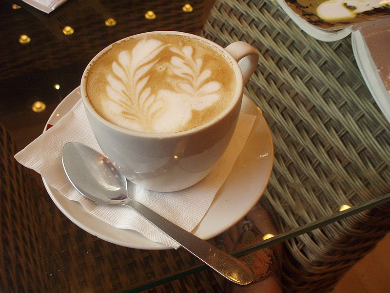
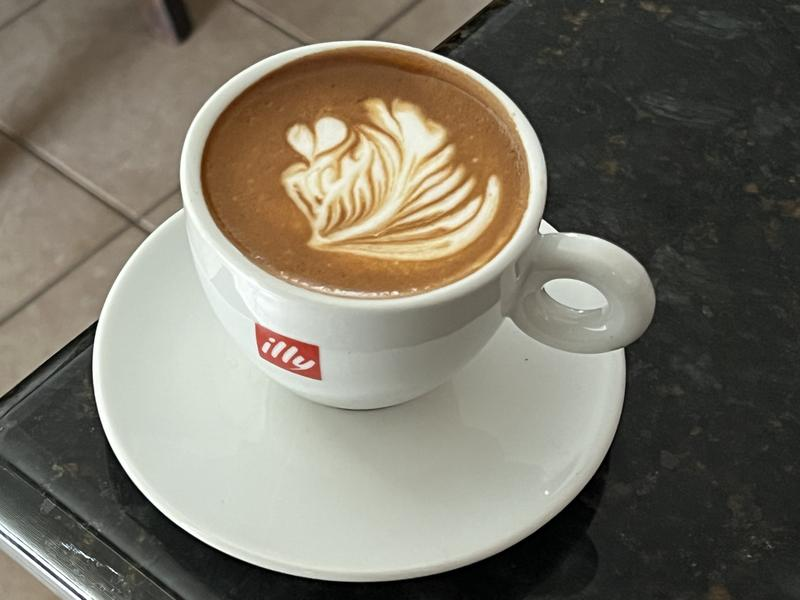
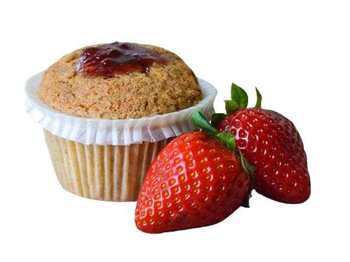
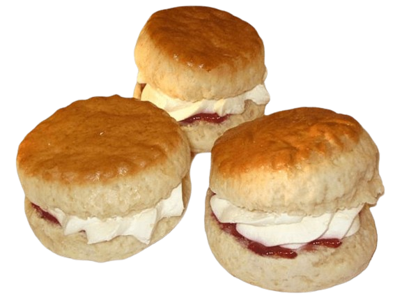

# Cozy Cup Cafe 

## Project Description :

COZY CUP CAFE House website project aims to provide an online platform for coffee enthusiasts. The website will showcase our cozy ambiance, diverse menu offerings, and a convenient way for customers to explore, order, and stay connected with our coffee community. Expect an inviting online experience that mirrors the warmth of our physical space.

## Features:

**Menu Display** 

- Showcase a visually appealing and interactive menu with detailed descriptions of coffee blends, beverages, and snacks.

**Contact and Location Information** 

- Provide clear contact details, including location maps, opening hours, and contact forms for inquiries or feedback.

**Social Media Integration** 

- Link social media accounts to the website for seamless sharing of updates, promotions, and user-generated content.

## Screen Captures:

### Image 1

**Description** The combination of rich espresso and velvety milk makes the latte a comforting and popular choice among coffee enthusiasts.

### Image 2

**Description:** Cappu like the latte, is an espresso-based coffee drink. It is known for its distinctive composition of equal parts espresso, steamed milk, and frothed milk. 

### Image 3

**Description:** A muffin is a delightful baked treat that falls under the category of pastries and is characterized by its small, individual size.

### Image 4

**Description:** It is usually made of either wheat flour or oatmeal, with baking powder as a leavening agent, and baked on sheet pans. 

## About the Authors

**Name:** Martinez, Nick Brienne 

**Email:** yvanparong1@gmail.com

